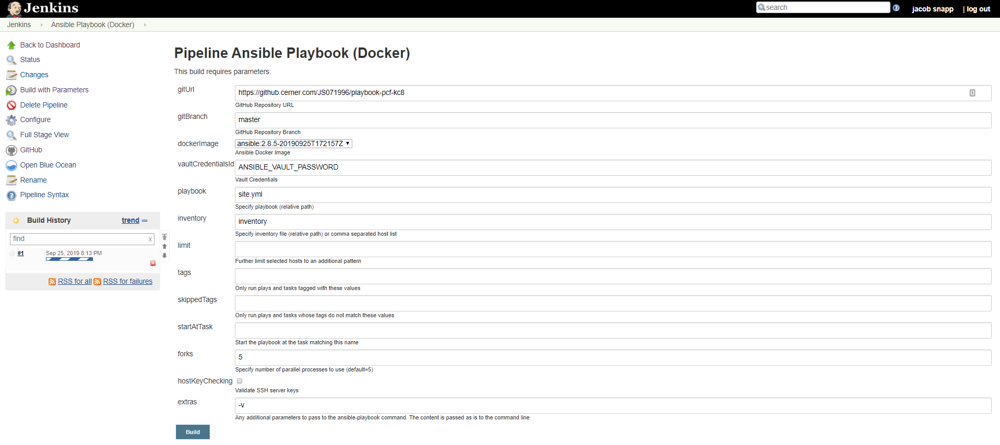

# Ansible Docker

This repository is a collection of DSL (Domain Specific Language) for Docker, Jenkins, Valinor (internal Cerner tool) used to manage and utilise a containerized Ansible execution environment for local development and pipeline execution.

The key files in this repository are:
- `Dockerfile`
- `Jenkinsfile`


There are two extra files useful in the management of the base Ansible docker image:
- `Vagrantfile`
  - Provides Linux VM with [Valinor](https://github.cerner.com/sre/valinor) to manage the build process of the base Ansible container image in compliance with Cerner standards.
- `project.yml`
  - Used by the [Valinor](https://github.cerner.com/sre/valinor) command line utility in the Vagrant VM.


## Why Ansible as a Docker Container?
Ansible is a fantastic tool for all of your Infrastructure Automation needs, but managing dependencies and an execution environment can be cumbersome and tricky.

- If you use a windows workstation, you most likely use WSL (Windows Subsystem Linux) or Vagrant VM to provide an execution environment and manage dependencies for Ansible.

- If you are MacOS or Linux user, you have it a bit easier and can manage everything in python virtual environments.

Most Ansible users begin with local playbook development and execution, but how do you reach devices that your local workstation cannot reach?

Ansible Tower and Ansible AWX (upstream Ansible Tower) offers the ability to establish an Ansible master in any environment, but why learn a whole new tool?

Jenkins is widely used at Cerner and enables us to create pipelines to automate our software development processes. We can also use it to orchestrate our Ansible automation.

## Ansible Container with Jenkins

This repository has a Jenkinsfile to run the Ansible container on Jenkins nodes. The Jenkinsfile has a list of parameterized inputs available to users in order to:
- Clone repositories containing an Ansible Project (`gitUrl`, `gitBranch`)
- Install dependencies (ansible roles, python packages) based on `requiremenets.yml` and `requirements.txt` files in root of repository.
- Specify the Ansible vault password using the Jenkins CredentialId (`vaultCredentialsId`)
- All other `ansible-playbook` specific command line options.

A Jenkins pipeline can be configured with this Jenkinsfile by pointing the Jenkins pipeline to this repository.



### Jenkins Requirements
- ansible plugin (https://plugins.jenkins.io/ansible)

## Can I pull the image from Artifactory?

Yes. The Ansible container image can be pulled from cernerrepos.net.


## How do I use the Ansible Container?

### Requirements

- Docker

### Basic Usage

To spin up and enter the base Ansible container:

```bash
docker run -it docker-integration.cernerrepos.net/js071996/ansible:2.8.5-<timestamp> bash
```

Do some verification
```bash
python --version
ansible --version
pip list
pip list --user
```

### Packaging your Ansible project into the container (Basic)

Mount your playbook directory into the container:
```
docker run -it -v <path>:/home/ansible docker-integration.cernerrepos.net/js071996/ansible:2.8.5-<timestamp> bash
```
This works, but what if you have some additional python dependencies?

> Note: You may find issues with this method due to the non overlapping UID and GID of users on your machine and the ansible user in the container.

### Packaging your Ansible project into the container (Preferred)

Place a Dockerfile in the root of your Ansible playbook folder/repository referencing the desired container version `<tag>`. You can also define a default `CMD` for describing how you want your playbook to execute by default if you do not pass a command to the container.

**Example**
```Dockerfile
FROM docker.cernerrepos.net/<org>/ansible:<tag>

CMD [ "ansible-playbook", "-i", "inventory", "site.yml", "-v" ]
```

**Build**
```bash
docker build -t <your-new-image-name> .
```

**Run**

Option #1 (default CMD):
```
docker run <your-new-image-name>
```
Option #2 (manual CMD):
```
docker run <your-new-image-name> ansible-playbook -i inventory ...
```

Option #3 (interactive):
```
docker run -it <your-new-image-name> bash
> ansible-playbook -i inventory ...
```


**What is happening behind the scenes?**

Using `ON BUILD` instructions in the Dockerfile, triggers have been defined for the:
- Automatic detection of `requirements.txt` in the root of your repository and subsequent installation of python dependencies.
- Automatic packaging (`COPY`) of your repository into the Ansible container for execution.

Thus, if you need to install additional python dependencies you only need to define a Dockerfile in your Ansible playbook repository and the build process with automatically install additional dependencies.

## How do I use Ansible Vault with the Ansible Container?

This container is designed to work in a Jenkins pipeline and for local execution.

For security purposes the Ansible docker container has some environment variable redirection (by default) as shown here:

```dockerfile
ENV ANSIBLE_VAULT_PASSWORD_FILE=/home/${USER}/vault-env
```
where `vault-env` is:
```bash
#!/bin/bash
echo ${ANSIBLE_VAULT_PASSWORD}
```

To pass the `ANSIBLE_VAULT_PASSWORD` to the container:

- Set the environment variable in the container
```bash
export ANSIBLE_VAULT_PASSWORD=<password>
```

- Or, pass the environment variable at runtime
```bash
docker run -e "ANSIBLE_VAULT_PASSWORD=<password>" ...
```

Environment variables can be overidden at runtime by Docker. You can opt out and directly point the `ANSIBLE_VAULT_PASSWORD_FILE` environment variable at a file in your workspace.

```bash
docker run -e "ANSIBLE_VAULT_PASSWORD_FILE=<PATH>/<TO>/<FILE>" ...
```
## How do I manage the base image on Artifactory? Valinor.

The `project.yml` file is used by the [Valinor](https://github.cerner.com/sre/valinor) command line utility to simplify interactions with Artifactory and adhering to the [RFC](https://github.cerner.com/standards/rfc) on docker images.

Use [Valinor](https://github.cerner.com/sre/valinor) to trigger remote Jenkins to build and push updates to the base Ansible container adhering to the RFC standards with labels and naming.

There are two extra files useful in the management of the base Ansible docker image:
- `Vagrantfile`
  - Provides Linux VM with [Valinor](https://github.cerner.com/sre/valinor) to manage the build process of the base Ansible container image in compliance with Cerner standards.
- `project.yml`
  - Used by the [Valinor](https://github.cerner.com/sre/valinor) command line utility in the Vagrant VM.


**Install Valinor**

You can either install Valinor on your host machine, or spin up the Vagrant VM defined by the `Vagrantfile` which will install Docker and Valinor automatically.

Option #1 (Vagrant):
```
vagrant up
vagrant ssh
```

Option #2 (Host):

Install [Valinor](https://github.cerner.com/sre/valinor) using `gem install valinor` from the [cerner-rubygems-internal repository](http://repo.release.cerner.corp/internal/rubygems/)

```
gem install valinor -v "1.X.X" --source http://repo.release.cerner.corp/internal/rubygems/
```

**Build (Local) Ansible Container Base Image**
```
valinor build
```

**Trigger Remote Jenkins Job**
```
valinor jenkins_build
```